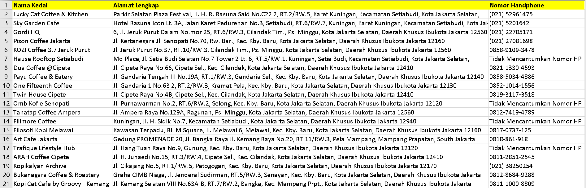

#  Google Maps Selenium Extractor

  

##  Deskripsi Singkat
Aplikasi otomasi (Robot) yang dibangun menggunakan antarmuka **Selenium WebDriver**. Didesain khusus untuk mengekstrak data kontak bisnis (Business Leads) berkualitas tinggi secara akurat, langsung dari antarmuka antarmuka Google Maps (termasuk Nomor Handphone aktif, Alamat Lengkap Terverifikasi, dan Nama Badan Usaha).

##  Fitur Unggulan Pembeda
Berbeda dengan sekadar mengandalkan API pihak ketiga (yang sering kali data *Nomor HP*-nya tidak terdata/disembunyikan), *script* Selenium ini diprogram untuk meniru tingkah laku pengguna manusia (*Human-like Automation*).
- **Auto-Scrolling:** Secara cerdas memicu skrip untuk men-*scroll* bilah lokasi demi memecahkan batas *Lazy Load* dari Google sehingga mampu menyedot data spesifik tanpa batas.
- **Deep Extraction Action:** Robot mengklik masuk ke dalam setiap profil bisnis untuk memaksa Maps memunculkan data rahasia/vital seperti Nomor WhatsApp/Kantor yang tersembunyi.
- **Data Cleanup Validation:** Kode ini dilengkapi fungsi Auto-Regex yang membunuh karat simbol *emoticon/icon* ghaib khas Map yang biasanya membuat layout Excel berantakan.

##  Stack Teknologi
- **Bahasa Utama:** Python 3+
- **Otomatisasi Engine:** Selenium WebDriver (Chrome)
- **Pengolahan & Tabulasi Data:** Pandas (CSV & Excel)

##  Catatan Untuk Klien
*Kami tunduk  pada hukum penambangan data etik. Oleh karenanya, alat ini sengaja diprogram agar mematuhi batas pelambatan jeda santun dari Google Maps untuk menjaga rasio IP Security dan kebersihan data Anda.*
